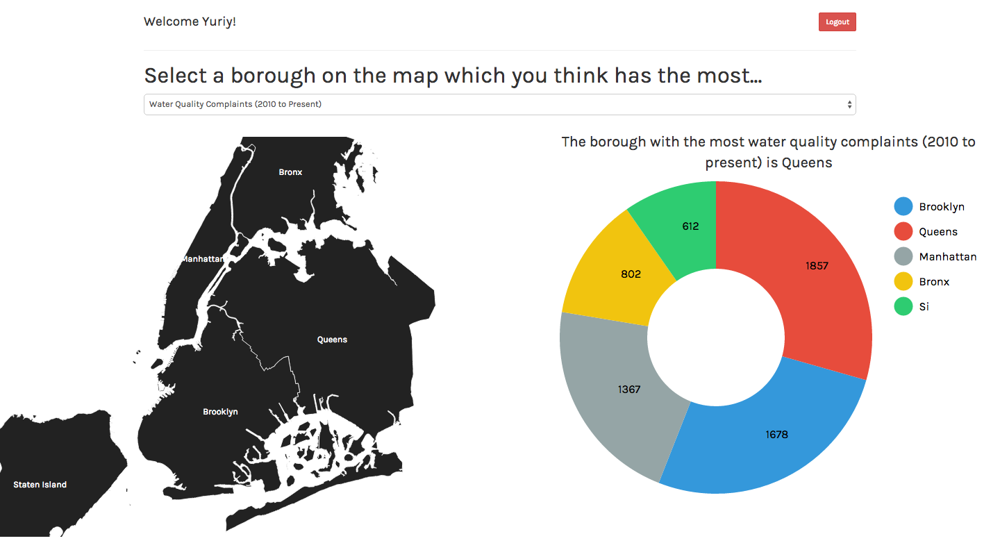

# NYC Data Visualization
## By [Alex](https://github.com/alex-ngv), [Sho](https://github.com/shoshaikh7) & [Yuriy](https://github.com/yuriyt2)

### Purpose
+ To allow users to visualize specific data from the NYC Open Data database broken down by borough.

### Features
+ Users are required to create an account in order to access the application.
+ A logged in user can select from a dropdown menu of available data points to visualize.
+ The user is required to click on the borough they think ranks the highest in the selected dataset.
+ Once a borough is selected a donut chart is shown representing the breakdown of the data by borough.

### Technology Used
+ Node.js, Express, MongoDB, D3
+ The server accesses the NYC open data API and stores the data in a mongo database.

### Setup
To test the app out locally:

1. Clone the repo.
2. Run a Node server from the app folder locally
3. Run a Mongo server.
4. Create a user account and log in.
